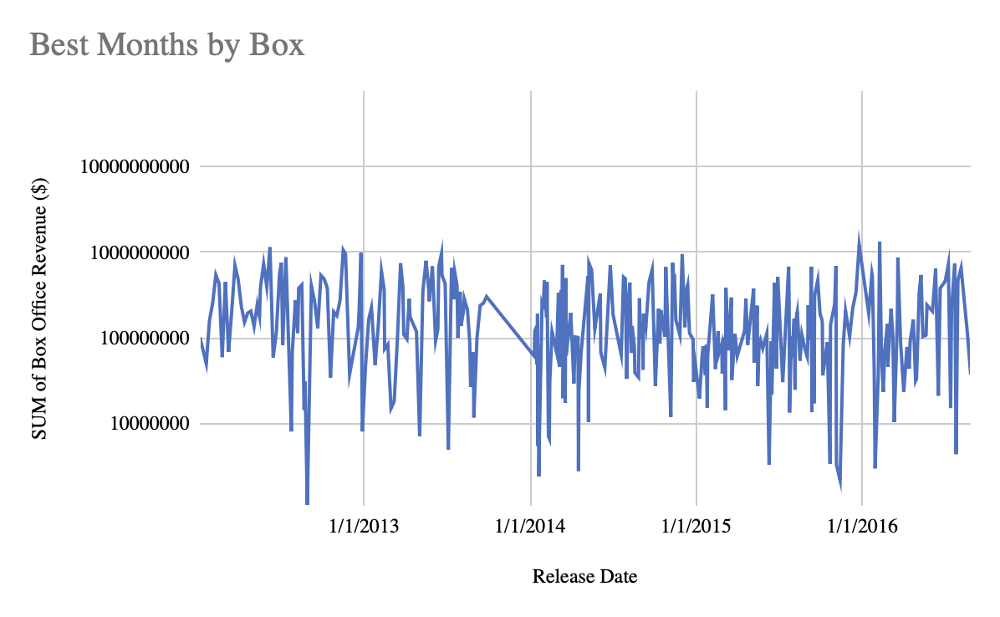

# Movie Data Analysis Dashboard (Apple TV Scenario)

An Excel & Google Sheets project that explores movie performance, genres, directors, and cast to surface practical insights and a clean, interactive dashboard.

  

## Project Overview
This analysis focuses on Apple-TV-style movie reporting. I built interactive pivot-based views with slicers (Genre, Director, Timeline) and charts:
- **Best Genres by Box** (column)
- **Best Months by Box** (line)
- **Best & Worst Profitable Movies** (ROI)
- **Top 5 Movies by Box & Budget**
- **Top 5 Actors by Box**

> Note: The Genre slicer intentionally **does not** control the *Best Genres by Box* chart (as specified).

## Data Sources
- `data/Movie_Data.xlsx` — Raw movie table (Title, Release Date, Genre, Director, Actors, Budget, Box Office, ROI).
- Additional homework/lesson files as provided by course materials.
- Screenshots of final dashboard & pivots live in `assets/`.

## Tools
- **Excel**: Pivot Tables, Charts, Slicers
- **Google Sheets**: Pivot Tables, Charts, Slicers, `QUERY`, `ARRAYFORMULA`, `INDEX/MATCH`
- Power Query concepts replicated in Sheets via formulas

## Data Cleaning / Preparation
1. Ensured **Release Date** is a true date type; **Budget** and **Box Office** numeric.
2. Trimmed extra spaces, standardized text fields (Genres, Directors, Actors).
3. Built a **long** “Actors” helper table with `ARRAYFORMULA + QUERY` to stack Actor1..Actor5.
4. Validated ROI = `Box Office / Budget - 1` (or ratio), handled blanks.

## Analysis & Dashboard
Pivot outputs feeding charts:
- **pvt_genre** → Best Genres by total Box Office (Column chart)
- **pvt_month** → Box Office by month (Line chart)
- **pvt_roi_best / pvt_roi_worst** → Top/Bottom movies by ROI (Bar charts)
- **pvt_top5_movies** → Top 5 by Box Office (with Budget)
- **pvt_actors** → Top 5 actors by Box Office (Column chart)

Slicers:
- **Genre**, **Director**, **Release Date (timeline)** controlling all pivots **except** the Genre slicer does not control the *Best Genres by Box* chart.

## Results and Findings
- **Genres**: (Fill with your actual top genres, e.g., “Action/Adventure leads total box; Comedy strong mid-pack.”)
- **Seasonality**: (E.g., “Summer and holiday months peak in box office.”)
- **Profitability**: (E.g., “Best ROI skew toward mid-budget thrillers; worst ROI cluster in high-budget misfires.”)
- **Actors/Directors**: (E.g., “Director X, Actor Y correlate with above-median box.”)

## Recommendations
1. **Portfolio mix**: Allocate more mid-budget productions in the top-performing genres from the analysis.
2. **Release timing**: Target peak months identified in the line chart; counter-program in known low-competition windows.
3. **Casting**: Prioritize actors/directors with consistent positive lift in box office/ROI.
4. **Risk mgmt**: Cap budgets in historically under-performing genres unless strong IP or talent justifies.

## How to Reproduce
1. Open `data/Movie_Data.xlsx` (or import to Google Sheets).
2. Create pivots as described in the README (or use my workbook).
3. Add slicers: Genre, Director, Release Date (timeline).
4. Connect slicers to all pivots **except** the Genre slicer to the *Best Genres by Box* pivot.
5. Insert charts and arrange as in the screenshot.
